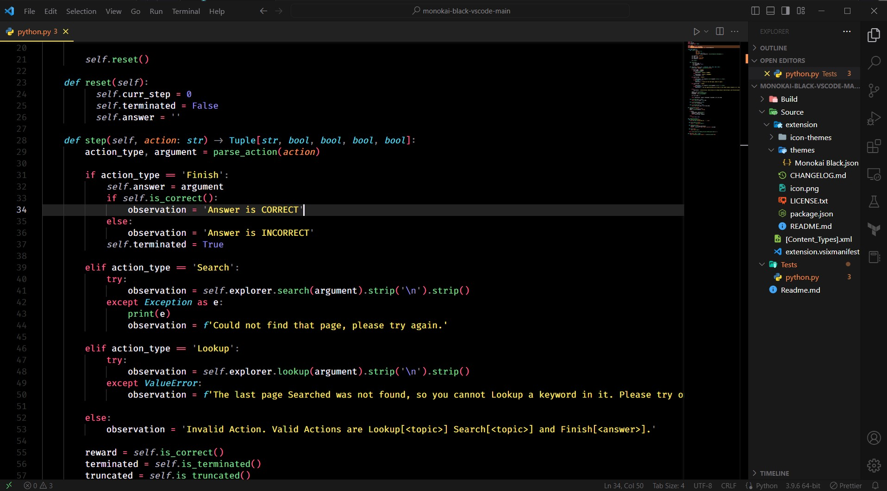
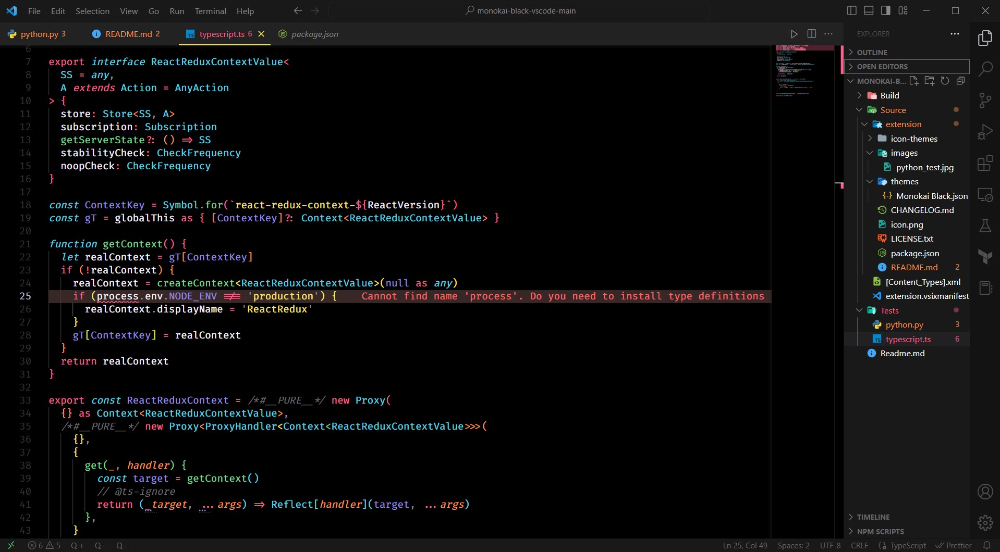

# Monokai Black

A true black Monokai theme for VS Code. Pure `#000000` backgrounds, Monokai-inspired syntax colors, and built-in markdown preview highlighting.

## Features

- **True black** editor, terminal, and panel backgrounds
- **Monokai palette** optimized for readability
- **Markdown preview** with syntax-highlighted code blocks (Shiki)
- **Semantic highlighting** support

## Install

Search "Monokai Black" in VS Code Extensions, or:

```
ext install brio-plus.theme-monokai-black-vscode
```

## Color Palette

| Token      | Color     | Hex       |
| ---------- | --------- | --------- |
| Background | Black     | `#000000` |
| Foreground | Off-white | `#f7f1ff` |
| Strings    | Yellow    | `#fce566` |
| Keywords   | Pink      | `#fc618d` |
| Functions  | Green     | `#7bd88f` |
| Comments   | Gray      | `#69676c` |
| Types      | Cyan      | `#5ad4e6` |
| Constants  | Purple    | `#948ae3` |
| Parameters | Orange    | `#fd9353` |

## Screenshots

**Python**


**TypeScript**


## Markdown Preview

Code blocks in markdown preview render with Monokai Black colors. Open any `.md` file and press `Ctrl+Shift+V` to preview.


## License

MIT - [Brio.Plus](https://brio.plus)
